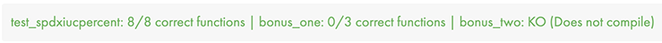

<h1 align="center">Printf</h1>

Deuxième projet de [42](https://42.fr/) dont le but est de recréer une version simplifiée de la fonction printf. 

---

### Utilisation :

Voici la déclaration de la fonction ft_printf.

```
int printf(const char *fmt, ...)
```

### Paramètres :

- `fmt` -La chaîne qui contient le texte à écrire sur stdout. Le prototype des balises de `fmt` est le spécificateur décrit ci-dessous :

| Spécificateur | Sortie |
| --- | --- |
| `%c`| Caractère |
| `%s`| Chaîne de caractères |
| `%d` ou `%i` | Entier décimal signé |
| `%u` | Entier décimal non signé |
| `%u` | Entier décimal non signé |
| `%p` | Adresse du pointeur |
| `%x` | Entier hexadécimal non signé |
| `%X` | Entier hexadécimal non signé (lettres majuscules) |
| `%%` | Caractère `%` |

---

### Construction du projet :

Arguments makefiles disponibles : `make all`, `make clean`, `make fclean`, `make re`, `make bonus`. 

---
### Functions contenues dans cette blibliothèque :

#### Majeur :
| Nom | Prototype |
| --- | --- |
| ft_printf | `int ft_printf(const char *fmt, ...)` |

#### Mineurs *(utiles au fonctionnement de `ft_printf`)* :
| Nom | Prototype |
| --- | --- |
| ft_calloc | `void	*ft_calloc(size_t count, size_t size)` |
| ft_memset | `void	*ft_memset(void *b, int c, size_t len)` |
| ft_putchar_fd | `void	ft_putchar_fd(char c, int fd)` |
| ft_putnbr_fd | `void ft_putnbr_fd(int n, int fd)` |
| ft_putunbr_fd | `void	ft_putunbr_fd(int n, int fd)` |
| ft_strchr | `char	*ft_strchr(const char *s, int c)` |
| ft_toupper | `int	ft_toupper(int c)` |
| i_to_hex | `char	*i_to_hex(uint64_t ull)` |
| ull_to_hex | `char	*ull_to_hex(uint64_t ull)` |
| putc_fd | `int	putc_fd(char c, int fd)` |
| putdi_fd | `int	putdi_fd(int n, int fd)` |
| putp_fd | `int	putp_fd(unsigned long long pnt, int fd)` |
| puts_fd | `int	putp_fd(unsigned long long pnt, int fd)` |
| putu_fd | `int	putu_fd(int n, int fd)` |
| putx1_fd | `int	putx1_fd(int n, int fd)` |
| putx2_fd | `int	putx2_fd(int n, int fd)` |

---
### Tests automatisés :

| [printfTester](https://github.com/Tripouille/printfTester) | 
| --- |
|  |

| [ft_printf_tester](https://github.com/paulo-santana/ft_printf_tester) |
| --- |


---
### Correction :


| |
| --- |
|  |


| | |
| --- | --- |
| Moulinette |  |
| Correcteur 1 |  |
| Correcteur 2 |  |
| Correcteur 3 |  |
